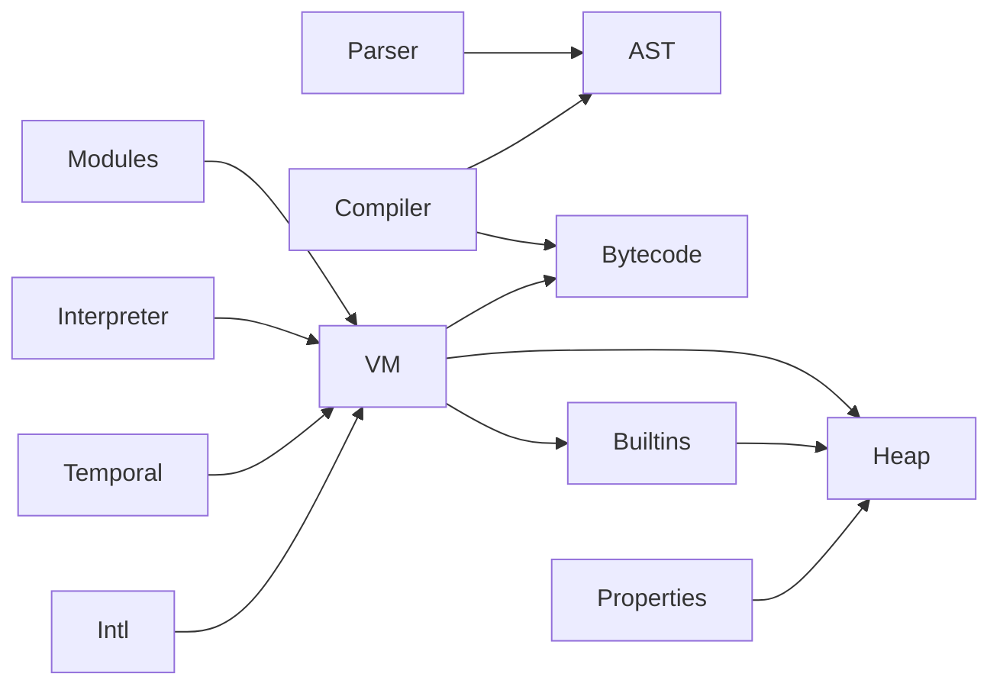

# BlueJS module boundaries

This document records the current ownership boundaries in `backend/bluejs`. It is an architecture guide, not a historical line-count log; exact current counts and the repository-wide source-size policy live in the [source-size audit](../SOURCE_SIZE_AUDIT.md).

## Current audit (2026-09-20)

All Rust source and integration-test files in `backend/bluejs` are at or below the repository's 2,200-line maintenance target. The largest are `vm/modules.rs` (2,140), `vm.rs` (2,098), `vm/temporal/iso.rs` (2,067), `tests/intl.rs` (2,067), and `vm/builtins/promises.rs` (2,003). These are reviewed files, not blanket refactor candidates: each has a cohesive owner and existing child-module seams. New independently evolving behavior must enter a child at that seam before expanding its parent past the target.

## Ownership and dependency direction

| Area | Parent owns | Child modules own |
| --- | --- | --- |
| Parser | Cursor state, diagnostics, public parse entry points | `module_items`, `module`, `statements`, `patterns`, `functions`, `expressions`, and parser-focused tests |
| Compiler | Compilation context, bytecode assembly, public compilation entry points | Statement, expression, function, and private-name lowering |
| Heap | Allocation-facing API, shared object references and common heap types | Binary-data slots, core storage, exotic behavior, lifecycle/GC, object storage, and heap tests |
| VM shell | Realm state, public execution and module APIs, limits, errors and common value plumbing | Module linking, interpretation, script/eval execution, properties, coercion/operations, regular expressions, JSON, functions, and host/test support |
| Built-ins | Installation surface and cross-family helpers | Object, arrays, promises, generators, binary data, typed arrays, collections, number/math/global/dynamic/resource-management families, execution, and native dispatch |
| Internationalization | VM-facing intrinsic installation and shared dispatch | Collator/Locale, DateTimeFormat, list/duration, number options/runtime, plural/segmenter, and shared helpers |
| Temporal | Public intrinsic wiring and shared Temporal entry points | Calendar, ISO values, conversion, dates, epoch/instant, plain value types, duration concerns, rounding, time-zone concerns, year-month, and zoned-date-time behavior |
| Test262 host | Public host adapter entry point | Cases, descriptors, foreign-object handling, harness support, and agent support |

The intended dependency direction is:

`Heap` does not call into the VM. Parser modules do not depend on compiler implementation modules. Feature modules consume shared heap/property contracts instead of recreating descriptor, receiver, GC-root, or internal-slot logic.

## Placement rules

- A grammar production belongs in its parser production module; its lowering belongs in the compiler module that owns the corresponding AST category.
- An ECMAScript internal object operation goes through heap storage or VM property operations. Proxy, class and built-in code must not duplicate those contracts.
- ArrayBuffer/view storage belongs in `heap/binary_data.rs`; JavaScript-visible constructors and methods belong in `vm/builtins/binary_data.rs` or `typed_arrays.rs`.
- Promise scheduling and generator request ownership belong to their built-in family; opcode resumption remains an interpreter/execution concern.
- An ECMA-402 service is added beside its existing VM-facing service module; locale provider data stays in `blueice-ecma402`, not in VM dispatch code.
- A Temporal change belongs to the type or operation module that owns its observable behavior. Do not recreate a common `temporal.rs` implementation for a type-specific concern.

## Ongoing review rule

When an edited Rust file reaches 1,200 lines or gains a distinct responsibility, review it against the [source-size audit](../SOURCE_SIZE_AUDIT.md). Before it would exceed 2,200 lines, extract the smallest cohesive child module, retain the parent public API, and add focused public-boundary regression coverage. Localized corrections in a cohesive module do not require a cosmetic split.

For current executable conformance evidence, use the [Ubuntu Test262 report](TEST262_LINUX_REPORT.md) and the [architecture-first backlog](TEST262_ARCHITECTURE.md), rather than inferring implementation status from file size.
