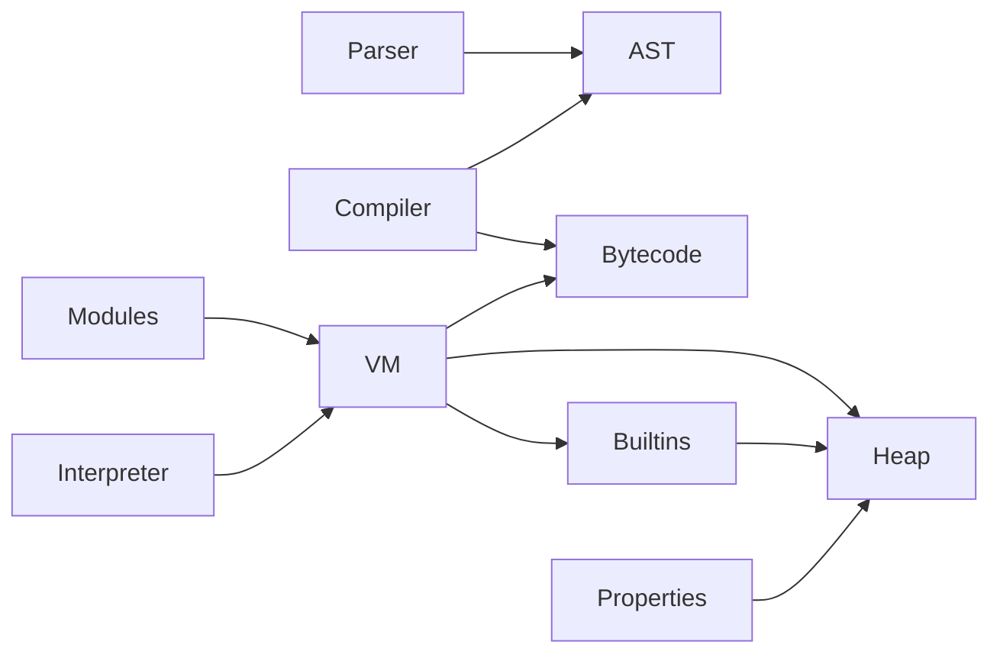

# BlueJS module boundaries

This refactor keeps the Phase 13 engine extensible as P0.4, P1.3, and P1.5
continue. It follows the dependency order in
[the Test262 architecture backlog](TEST262_ARCHITECTURE.md): object internal
methods are shared infrastructure; suspension and binary data build on heap
lifetime and internal slots.

## Audit result

The audit considered every Rust source file over 2,000 lines in `backend/bluejs/src`.
The large files were not divided by line count. Each split follows a runtime or
front-end ownership boundary, and the public crate API remains at its existing
entry points.

| Root module | Before | After | Extracted responsibilities |
| --- | ---: | ---: | --- |
| `parser.rs` | 4,882 | 580 | Module items, statements, patterns, function grammar, expressions, parser tests |
| `compiler.rs` | 5,031 | 1,595 | Statement lowering, expression lowering, function/class lowering, private-name early validation |
| `heap.rs` | 3,602 | 1,911 | Binary-data slots, object storage/descriptors, lifecycle and GC, heap tests |
| `vm.rs` | 7,152 | 1,736 | Static/dynamic modules, bytecode interpreter, property operations, script/eval execution, runtime operations |
| `vm/builtins.rs` | 8,082 | 1,916 | Objects/Proxy, promises, generators, binary data, iterator/closure execution, globals, native dispatch, Array and Math |

No Rust source file in `backend/bluejs/src` exceeds 2,000 lines after the split.
The largest remaining leaf is `vm/builtins.rs` at 1,916 lines; additions to it
must be assigned to an existing builtin family or a new family module before it
grows beyond the audit limit.

## Ownership and dependency direction

| Area | Root owns | Child modules own |
| --- | --- | --- |
| Parser | Cursor state, diagnostics, public `parse_module` export | Grammar productions grouped by ModuleItem, statement, pattern, function, and expression ownership |
| Compiler | Compilation context, bytecode assembly, public compilation entry points | AST lowering for statements, expressions, functions/classes, and private-name early-error validation |
| Heap | Object records, allocation-facing constructors, shared types and public Heap API | `binary_data`: ArrayBuffer/DataView/TypedArray slots and numeric-index conversion; `object_storage`: descriptors, property storage, array length and key order; `lifecycle`: prototype/extensibility plus write barriers and collection |
| VM | Realm state, public execution/module APIs, errors, limits and common types | `modules`: linking/import/TLA; `interpreter`: opcode dispatch; `properties`: receiver-aware property/reference operations; `execution`: script declarations, scopes and eval; `operations`: coercion, string/numeric/comparison and `with` operations |
| Builtins | Cross-family helpers and builtin installation surface | `object`, `promises`, `generators`, `binary_data`, `execution`, `native_dispatch`, `globals`, `arrays`, and `math` each own one builtin family or dispatch concern |

The intended dependency direction is:

`Heap` never calls into the VM, and parser modules do not depend on compiler
implementation modules. That keeps GC and property contracts reusable by Proxy,
classes and views without creating execution-layer cycles.

## Internal API rules

Public APIs were preserved; this refactor did not promote internal operations to
crate-wide APIs. A child of `parser`, `compiler`, `heap`, or `vm` uses
`pub(super)` only when its parent or sibling needs the inherent method. Nested
`vm::builtins::*` modules use `pub(in super::super)` only for methods that must
be invoked by another VM subsystem such as the interpreter or error conversion.
Existing `pub` and `pub(crate)` methods retain their former visibility.

New implementation work belongs at the narrowest owner:

- A grammar production goes in a parser production module; its bytecode lowering
  goes in the compiler module that owns the matching AST category.
- An ECMAScript internal object operation goes through `heap/object_storage.rs`
  or `vm/properties.rs`; Proxy, class, and builtin code must not duplicate
  descriptor or receiver handling.
- Heap-visible ArrayBuffer/View data and numeric-index semantics go in
  `heap/binary_data.rs`; builtin constructors and methods go in
  `vm/builtins/binary_data.rs`.
- Suspension state transitions, queue ownership, and promise settlement go in
  the generator/promise builtin modules; bytecode resumption stays in the VM
  interpreter/execution modules.
- A new standard-library family gets its own `vm/builtins/<family>.rs` module
  once it has a distinct constructor/prototype or dispatch contract.

## Phase impact

P1.3's rooted generator frames, async-generator request queues and Promise job
handling now live in separate generator, promise, and execution files. This
makes the invariant visible: queue and continuation ownership is heap-backed,
while opcode resumption remains an interpreter concern.

P0.4's descriptor, `[[Get]]`/`[[Set]]`, `[[OwnPropertyKeys]]`, extensibility,
and prototype operations now have explicit heap/VM boundaries. Proxy and class
work must consume those boundaries instead of installing parallel object
semantics.

P1.5's fixed-length ArrayBuffer, detach state, DataView and TypedArray storage
is separated from its JavaScript-facing constructors. Resize, SharedArrayBuffer
and Atomics can extend the binary-data layers without changing ordinary object
storage or promise/generator code.

## Ongoing audit rule

Before a BlueJS Rust source module exceeds 2,000 lines, review its methods by
runtime responsibility, add a child module at a dependency boundary, and keep
focused regressions with the moved behavior. Do not split a file only by
contiguous line range. After a boundary change, run the focused tests for that
area plus the BlueJS crate suite, formatting, Clippy with warnings denied, and
a whitespace diff check.

## Validation

The refactor was validated with:

- `cargo test -p blueice-bluejs` (all BlueJS unit and integration test targets pass)
- `cargo clippy -p blueice-bluejs --all-targets -- -D warnings`
- `cargo fmt --all -- --check`
- `git diff --check`

The host adapter regression now expects an unbound optional-chain base to reach
runtime as `ReferenceError`, rather than retaining the obsolete `unsupported`
classification. The compiler regression for an explicit derived constructor
with a conditional direct `super()` now expects compilation to succeed. Unicode
case/normalization tests retain their ECMAScript result assertions but no longer
pin Rust and `unicode-normalization` to an identical Unicode data release.
